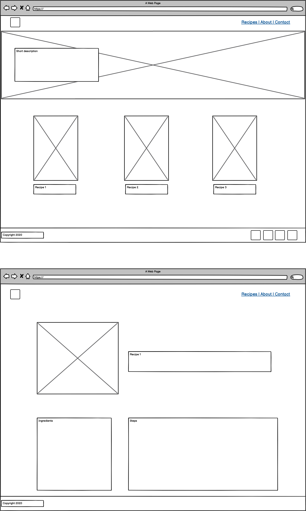

# Carol's Kitchen

Spanish recipes in English. 
 
## UX
USER STORIES:
- As a user I want to find Spanish recipes. 
- As a user I want to easily navigate the site. 
- As a user I want to contact the site owner.
- As the site owner I want people to find recipes and navigate them easily.

Desktop wireframe:

 

Mobile wireframe:

 

## Features
 
### Existing Features
- Feature 1 - Allows users to see all the available recipes.
- Feature 2 - Allows users to click and see the ingredients and steps for the recipes.
- Feature 3 - Allows users to send a message with a question. 

Future features: 
- Recipes linked to the carousel.
- Video explanation in the different steps of the recipes. 
- Ranking most shared recipes. 

### Features Left to Implement
- Button to share recipes on social networks. 

## Technologies Used

In this section, you should mention all of the languages, frameworks, libraries, and any other tools that you have used to construct this project. For each, provide its name, a link to its official site and a short sentence of why it was used.

- [HTML](https://www.w3schools.com/html/html_intro.asp)
    - This project uses **HTML** to build the structure of my project. 

- [CSS](https://www.w3schools.com/css/css_intro.asp)
    - This project uses **CSS** to style HTML.

- [Bootstrap](https://getbootstrap.com/)
    - This project uses **Bootstrap** to void use their framework on the site.

- [CSS Variables](https://developer.mozilla.org/en-US/)
    - This project uses **CSS Variables** to avoid reusing properties. I've seen them on the console and wanted to try them as well. 

- [Tiny Png](https://tinypng.com/)
    - This project uses **Tiny PNG** to reduces images size. 
    
- [Favicon.io](https://favicon.io/)
    - This project uses **Favicon** for the site Favicon.

## Testing

In this section, you need to convince the assessor that you have conducted enough testing to legitimately believe that the site works well. Essentially, in this part you will want to go over all of your user stories from the UX section and ensure that they all work as intended, with the project providing an easy and straightforward way for the users to achieve their goals.

Whenever it is feasible, prefer to automate your tests, and if you've done so, provide a brief explanation of your approach, link to the test file(s) and explain how to run them.

For any scenarios that have not been automated, test the user stories manually and provide as much detail as is relevant. A particularly useful form for describing your testing process is via scenarios, such as:

1. Contact form:
    1. Go to the "Contact Us" page
    2. Try to submit the empty form and verify that an error message about the required fields appears
    3. Try to submit the form with an invalid email address and verify that a relevant error message appears
    4. Try to submit the form with all inputs valid and verify that a success message appears.

In addition, you should mention in this section how your project looks and works on different browsers and screen sizes.

You should also mention in this section any interesting bugs or problems you discovered during your testing, even if you haven't addressed them yet.

If this section grows too long, you may want to split it off into a separate file and link to it from here.

What do you do? | Expected Behaviour | Pass/Fail  |
| ------------- |-------------| -----|
| Click picture to open recipe| Open recipe in a new tab | Pass |
| Click link to open recipe| Open recipe in a new tab | Pass |
| Click Recipes on navbar | Scroll down to Recipe section | Pass |
| Slide on carousel| Slide to the left and the right|   Pass |
| Open social media links | Open a new tab | Pass |
| Contact the site owner | Request a name, email with the correct format and the question | Pass |
| Submit a question | Show alert for message received | Pass |

## Deployment

This section should describe the process you went through to deploy the project to a hosting platform (e.g. GitHub Pages or Heroku).

In particular, you should provide all details of the differences between the deployed version and the development version, if any, including:
- Different values for environment variables (Heroku Config Vars)?
- Different configuration files?
- Separate git branch?

In addition, if it is not obvious, you should also describe how to run your code locally.

## Credits

### Content
All the content on this site is my own.

### Media
- The photos used in this site were obtained from [Pixabay](https://pixabay.com/)
- The icons used in this site were obtained from [FontAwesome](https://fontawesome.com/)
- The fonts used in this site were obtained from [Google Fonts](https://fonts.google.com)
- The color palette used in this site was obtained from [Colorhunt.co](https://colorhunt.co)

- Box Shadow in CSS line 72 is from [Box Shadow - TailwindCSS](https://tailwindcss.com/docs/box-shadow)

- Responsive Hero Image was obtained from [MDN web docs](https://developer.mozilla.org/en-US/docs/Learn/HTML/Multimedia_and_embedding/Responsive_images)

### Acknowledgements

- I received inspiration for this project from [Donal Skehan](https://donalskehan.com/recipes/)